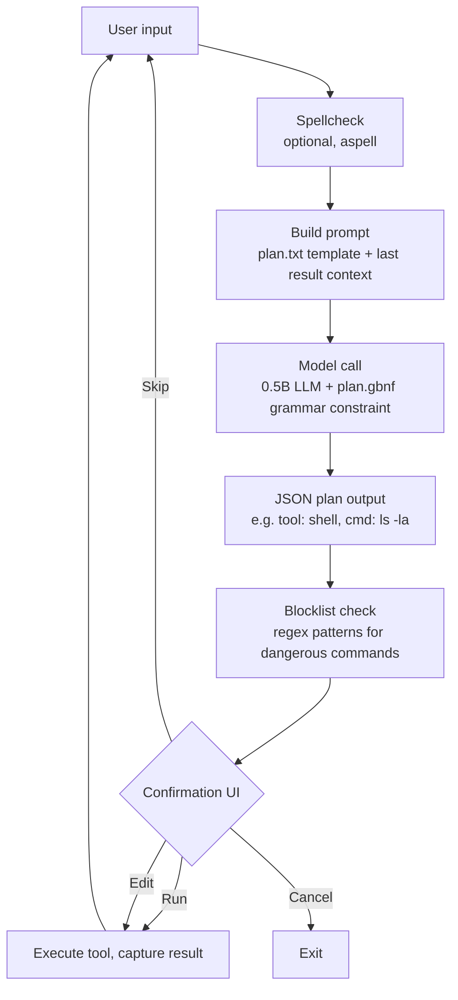

# tinyagent

A bash REPL agent powered by a 0.5B parameter LLM running locally via llama.cpp. The model's only job is translating natural language into structured tool calls. Deterministic code handles everything else. Every action requires human confirmation.

~400MB total footprint. Runs on Linux, macOS, and Termux.

## Philosophy

Most AI agents give a large model broad autonomy and hope it behaves. Tinyagent takes the opposite approach:

- **The model is a parser, not a decision-maker.** A tiny 0.5B model translates human intent into structured JSON tool calls. It doesn't reason, plan strategies, or make judgment calls. It maps words to tools.
- **Grammar enforcement, not prompt engineering.** The model's output is physically constrained by a GBNF grammar at the token generation level. It cannot produce anything outside the defined schema. No amount of prompt injection or hallucination can bypass this - invalid tokens are filtered before they're even considered.
- **Humans approve, machines execute.** Every tool call is shown to the user as a card before execution. You run it, skip it, edit it, or cancel. The agent never acts without consent.
- **Dangerous commands are blocked structurally.** A regex blocklist catches destructive patterns (rm -rf, mkfs, curl|bash, fork bombs) before they even reach the confirmation prompt.

The result: a predictable agent where the model's output space is mathematically bounded, not just probabilistically encouraged.

## How grammar enforcement works

The key insight is that llama.cpp supports GBNF (GGML Backus-Naur Form) grammars that constrain token generation at inference time. This isn't post-processing or validation - it's a hard constraint on what the model can output.

Here's the grammar that controls the agent (`grammars/plan.gbnf`):

```gbnf
root ::= "{\"plan\":[" step ("," step)* "]}"

step ::= read-step | write-step | shell-step | search-step

read-step   ::= "{\"tool\":\"read\",\"args\":{\"path\":" string "}}"
write-step  ::= "{\"tool\":\"write\",\"args\":{\"path\":" string ",\"content\":" string "}}"
shell-step  ::= "{\"tool\":\"shell\",\"args\":{\"cmd\":" string "}}"
search-step ::= "{\"tool\":\"search\",\"args\":{\"query\":" string "}}"
```

This means the model can ONLY output:
- A JSON object with a `plan` array
- Each element must be one of exactly four tool types: `read`, `write`, `shell`, `search`
- Each tool has a fixed argument schema
- No free-form text, no explanations, no markdown, no apologies

To add a new tool, you add one line to the grammar. To remove a tool, you delete that line. The model physically cannot call tools that aren't in the grammar. This is how you control what the agent can do - not by asking nicely in a prompt, but by defining the output space formally.

Combined with `temperature: 0`, the same input always produces the same output. The agent is deterministic.

## Pipeline



## Setup

```bash
bash setup.sh
```

Detects platform (Termux / Linux / macOS), installs deps, builds llama.cpp, downloads Qwen2.5-Coder-0.5B-Instruct Q4_K_M.

## Usage

```bash
bash agent.sh
```

Type natural language requests. The model extracts tool calls, you confirm before execution.

### Tools

| Tool | Description |
|------|-------------|
| `read(path)` | Read a file |
| `write(path, content)` | Write a file |
| `shell(cmd)` | Run a shell command |
| `search(query)` | Search the web via DuckDuckGo |

### Commands

| Command | Description |
|---------|-------------|
| `/help` | Show help |
| `/log` | Show session log path |
| `/quit` | Exit |

## Tests

```bash
bash tests.sh
```

## Session logs

JSONL files in `logs/`, one per session. Events: `user_input`, `model_raw`, `parse_result`, `plan_shown`, `user_action`, `exec_start`, `exec_done`, `blocked`.

## Project structure

```
tinyagent/
  agent.sh          Main REPL loop and tool execution
  search.sh         DuckDuckGo Lite scraper
  fetch.sh          Web content fetcher (lightpanda or curl fallback)
  setup.sh          One-time platform setup
  tests.sh          Test suite
  blocklist.txt     Dangerous command patterns (regex)
  grammars/
    plan.gbnf       Output grammar constraint
  prompts/
    plan.txt        Prompt template
  models/
    *.gguf          Quantized model file (~491MB)
  logs/             JSONL session logs
```
